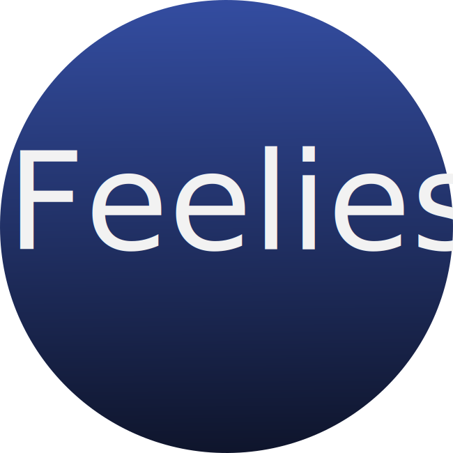

# HackTheNortheast Project: Feelies
Feelies is a web application made for the Hack the Northeast Hackathon. It is a site that allows for people to log how they feel and it collect the information to show them that they are not alone in what they feel. In times like these it is easy to feel isolated and like your emotions aren't warrented, and feelies is here to make you feel less alone.
## To see live webpage go to http://172.105.149.150:5000/

## Made with love by Lauren Gayle and Nicholas Blackburn ;]
### check out Nicholas personal webpage! http://nicholasblackburn.space

